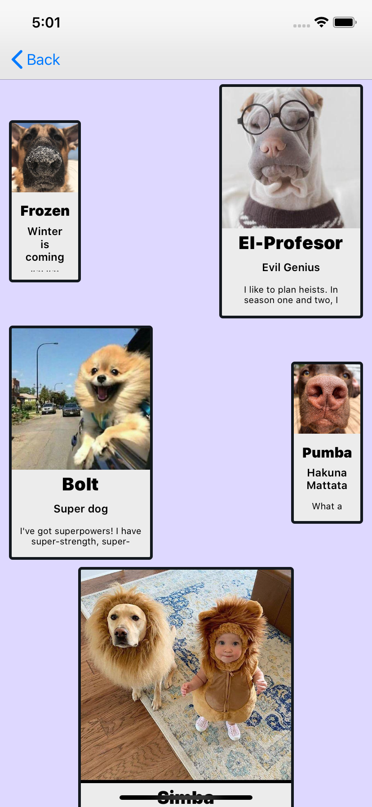
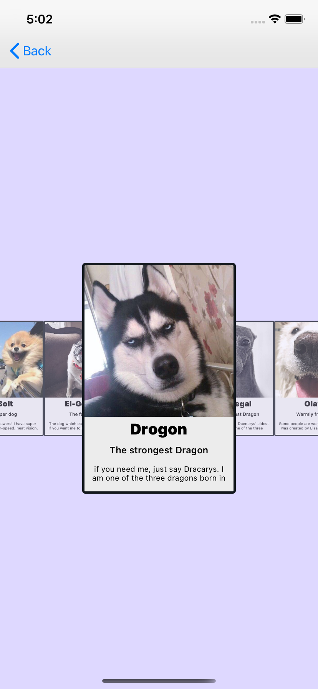
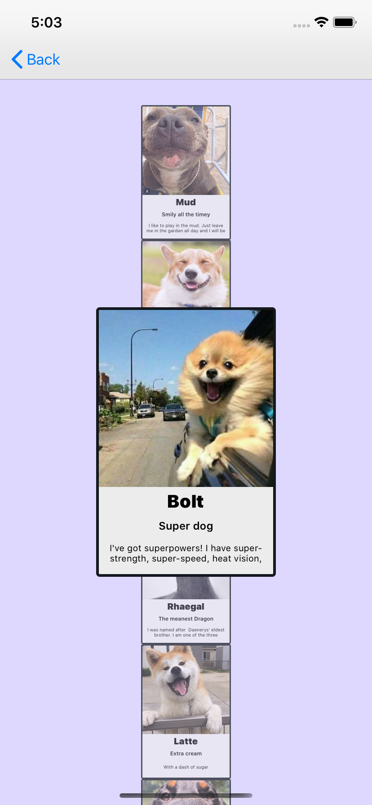
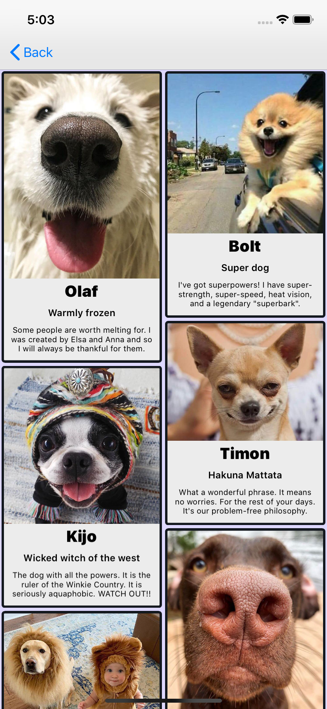
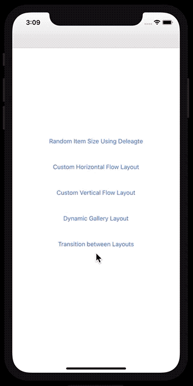
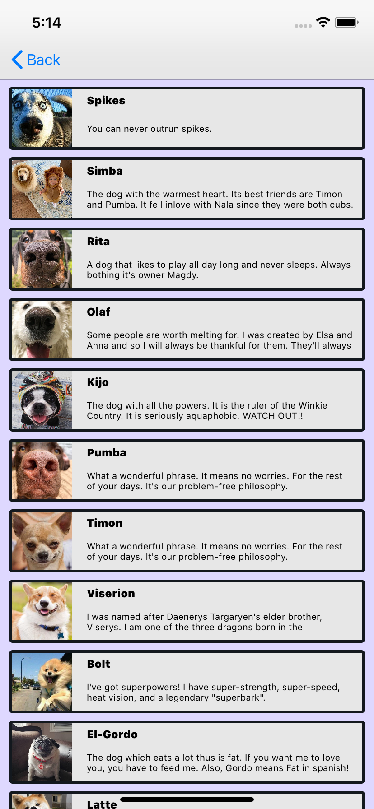
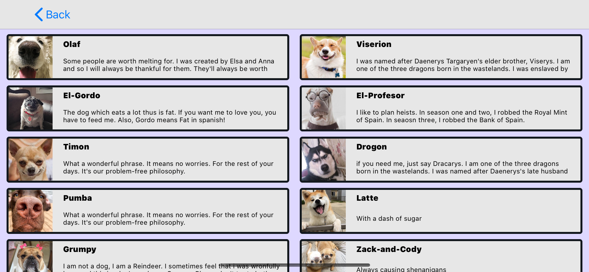

# MSZCollectionViewLayouts 
 
 

MSZ Custom Layouts examples for CollectionViewLayout.

**Note**: The project requires Xcode 11, Swift 5 and iOS 13.

## Table of Demos

- [On master Branch](https://github.com/MagdyZamel/MSZCollectionViewLayouts)
    - [Random Item Size Using Delegate](#Random-Item-Size)
    - [Custom Horizontal Flow Layout](#Custom-Horizontal-Flow-Layout)
    - [Custom Vertical Flow Layout](#Custom-Vertical-Flow-Layout)
    - [Dynamic Gallery Layout](#Dynamic-Gallery-Layout)
    - [Transition between Layouts](#Transition-between-Layouts)

- [On landscapePortraitDemo Branch](https://github.com/MagdyZamel/MSZCollectionViewLayouts/tree/landscapePortraitDemo)
    - [One item per row](#One-item-per-row)
    - [Two items per row in landscape](#Two-items-per-row)

### Random Item Size Using Delegate

  - Each item in the collection view is generated with a random size using UICollectionViewDelegateFlowLayout 
  
**Note**: Code is available - [On master Branch](https://github.com/MagdyZamel/MSZCollectionViewLayouts)

### Custom Horizontal Flow Layout

  - Each item is scaled based on how far it is to the center of the collection view relative to the x-axis 
  
**Note**: Code is available [On master Branch](https://github.com/MagdyZamel/MSZCollectionViewLayouts)

### Custom Vertical Flow Layout

  - Each item is scaled based on how far it is to the center of the collection view relative to the y-axis 
  
**Note**: Code is available[On master Branch](https://github.com/MagdyZamel/MSZCollectionViewLayouts)

### Dynamic Gallery Layout

  - Dynamic Gallery Layout where each item takes up enough space to fit its content
  - No spacing Fragments between items
  
**Note**: Code is available [On master Branch](https://github.com/MagdyZamel/MSZCollectionViewLayouts)

### Transition between Layouts

  - Transitions between Dynamic Gallery Layout and FlowLayout
  
**Note**: Code is available [On master Branch](https://github.com/MagdyZamel/MSZCollectionViewLayouts)

### One item per row

  - One item per row in the collection view implemented using subclassing UICollectionViewFlowLayout 
  
**Note**: Code is available [On landscapePortraitDemo Branch](https://github.com/MagdyZamel/MSZCollectionViewLayouts/tree/landscapePortraitDemo)

### Two items per row in landscape

  - One item per row in portrait mode and two item per row in landscape mode implemented using subclassing UICollectionViewFlowLayout 
  
**Note**: Code is available [On landscapePortraitDemo Branch](https://github.com/MagdyZamel/MSZCollectionViewLayouts/tree/landscapePortraitDemo)

